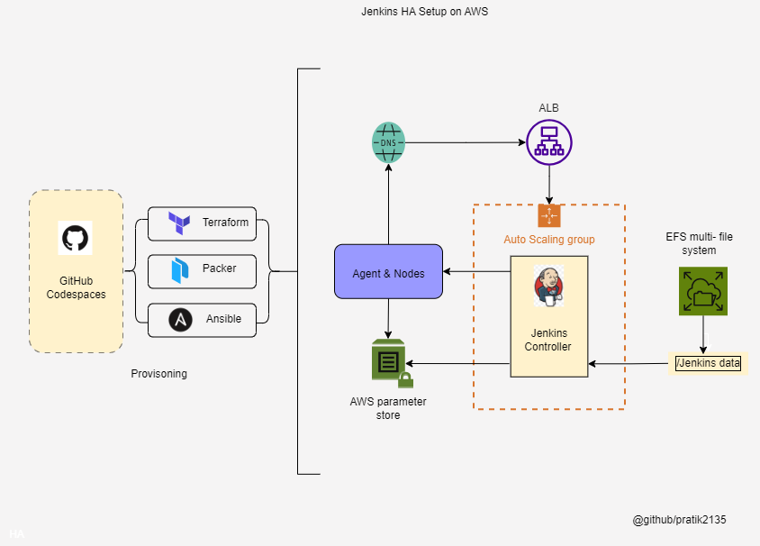

#  Jenkins HA Setup on AWS (Adapted for GitHub Codespaces)

## 📌 About This Fork

This fork of the original Jenkins HA project has been modified to run effectively within **GitHub Codespaces**. It is tailored for learners or DevOps practitioners looking to simulate infrastructure scenarios in a lightweight, cloud IDE environment.

While not a full production-grade deployment, it replicates common DevOps challenges in infrastructure automation using Jenkins, Packer, Terraform, and Ansible.

## 🔄 Key Enhancements in This Fork

- Fixed broken Packer AMI configurations for Jenkins Controller/Agent setup
- Modified Ansible playbooks to resolve dependency and path-related issues
- Improved Terraform scripts for smoother resource provisioning in AWS
- Added support for remote EFS setup within the constrained Codespaces environment
- Added logs and error snapshots for educational purposes

## 🧰 Stack Used

- Jenkins (HA simulated)
- AWS (via Terraform)
- Packer for AMI creation
- Ansible for provisioning
- GitHub Codespaces as the development environment

> **Note:** This README is customized for this fork. It is intended for educational purposes

---

## 📊 Architecture Diagram

---

## 🧠 Learnings & Real-World Relevance

Although implemented in a sandbox environment, the project involved hands-on experience with real DevOps tools, debugging common infrastructure issues, and adapting automation scripts under practical constraints.

## 💬 Blog Coming Soon

I’m preparing a write-up covering:
- Real-world DevOps challenges during this setup
- Architecture breakdown
- Lessons learned while working with Jenkins, AWS, Ansible, and Terraform
